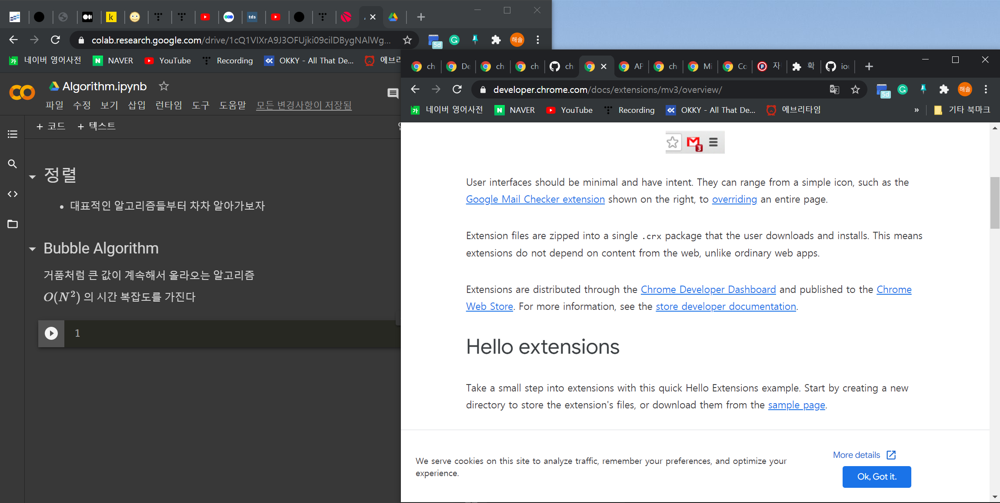

# Tab Holder 

* 인터넷을 쓸 때 우리는 tab을 많이 띄어놓고 검색을 한다. 그리고 주제가 겹치는 대로 window(창)을 따로 띄운다.

* 그런데 그런 상황이 있다. 집중하고 싶은 window를 제외한 창들을 잠시 끄고 작업하고 싶을 때가 있다. 

* window + tab 키로 워크 스페이스를 전환할 수 있지만 결국 메모리를 차지한다.
  
* (특히 노트북에서)메모리양을 줄이고 + 브라우저를 쾌적하게 하여 생산성을 늘리는 앱